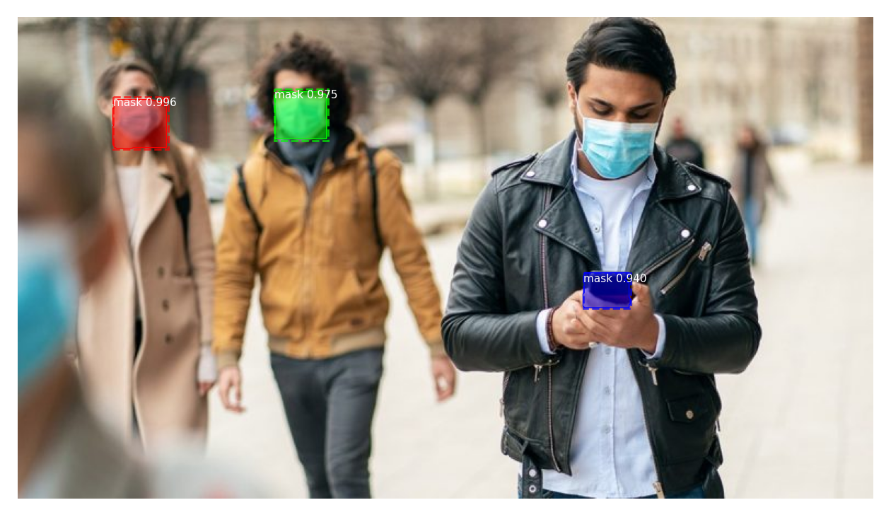
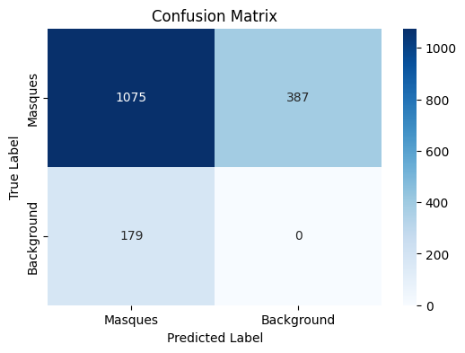

# Rapport d'entrainement d'un modèle - IA M2 

## Groupe
- YOUSFI Souhila
- THOMAS Charles

---


## Vue d'ensemble
Ce rapport détaille le processus d'entraînement et les résultats de notre modèle, incluant les logs, des exemples du jeu de données, les graphes de perte, la matrice de confusion, les hyperparamètres, et les observations finales.

Ce répertoire contient les notebook utilisés pour entrainer et évaluer le modèle dans le dossier ```/src/eval.ipynb``` et ```/src/train.ipynb```

## 1. Logs

```
Epoch 1/6
100/100 [==============================] - 1575s 16s/step - loss: 3.4451 - val_loss: 2.5046
Epoch 2/6
100/100 [==============================] - 1553s 16s/step - loss: 2.3474 - val_loss: 2.3218
Epoch 3/6
100/100 [==============================] - 1554s 16s/step - loss: 1.8803 - val_loss: 1.3393
Epoch 4/6
100/100 [==============================] - 1527s 15s/step - loss: 1.7480 - val_loss: 0.9975
Epoch 5/6
100/100 [==============================] - 1522s 15s/step - loss: 1.6851 - val_loss: 1.1672
Epoch 6/6
100/100 [==============================] - 1529s 15s/step - loss: 1.5312 - val_loss: 0.7886
```
_Dernière Ligne du log :_  
Perte d’Entraînement (dernier epoch) : **1.6851**  
Perte de Validation (dernier epoch) : **1.1672**

## 2. Exemples du Jeu de Données
Voici quelques exemples tirés du jeu de données, incluant des échantillons utilisés pour l'entraînement, la validation et le test.


## 3. Exemples de détections
Voici quelques exemples provenant de différentes versions de notre modèle, on peut voir des erreur dans nos tests qui ont mené à un modèl sous-entrainés et parfois de fausses détections provenants d'un sur-entrainement. Finalement nous avons conservé le modèle le plus équilibré.

D'autres évaluations sont disponibles dans le notebook eval.ipynb





## 4. Matrice de Confusion
La matrice de confusion ci-dessous montre les performances du modèle sur le jeu de données de test.



## 5. Graphe des Pertes

Les graphs ci-dessous montrent la progression des pertes d'entraînements et de validations au cours de chaque epoch, lors de nos apprentissages nous avons utilisé ce graph afin d'étudier la convergence du modèle pour détecter le sur-apprentissage et adapter le nombre d'epochs nécessaire.


## 6. Hyperparamètres
Le tableau suivant résume les hyperparamètres que nous avons testés lors de l'entraînement et la valeur finale que nous avons utilisé.

| Hyperparamètre       | Valeur(s) Testée(s)        | Valeur Finale        |
|----------------------|----------------------------|-----------------------|
| Learning Rate | `0.001`, `0.005`, `0.01` | `0.001`           |
| Optimizer           | `SGD`, `Adam`   | `SGD`               |
| Epochs               |  `100`, `250`, `500`  |  `100`                |
| Regularization       | `L1: 0.001`, `L1: 0.0001`  | `Pas de L1, uniquement le régularisateur L2 par défaut` |
|IMAGE_MAX_DIM | `512`, `1024` | `512` |

## 7. Observations et Commentaires
Basé sur les résultats, voici quelques observations et réflexions générées manuellement :
  
- **Efficacité des Hyperparamètres :** Parmi les hyperparamètres testés, pour notre dataset, le taux d'apprentissage de `0.001` avec l'optimiseur `SGD` a permis la meilleur convergence.

- **Analyse de la Matrice de Confusion :** On peut  conclure que notre modèle est performant mais pourrait être perfectible en testant d'autres paramètres, en faisant attention à ne pas être dans un cas d'overfiting.


---
