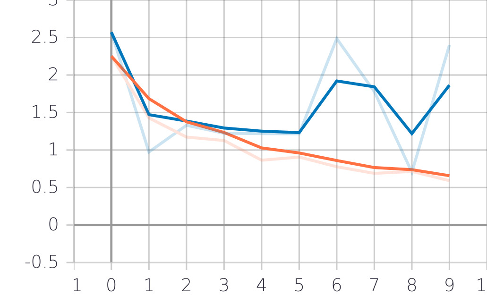

# Rapport d'entrainement d'un modèle - IA M2 

## Groupe
- YOUSFI Souhila
- THOMAS Charles

---


## Vue d'ensemble
Ce rapport détaille le processus d'entraînement et les résultats de notre modèle, incluant les logs, des exemples du jeu de données, les graphes de perte, la matrice de confusion, les hyperparamètres, et les observations finales.

Ce répertoire contient les notebook utilisés pour entrainer et évaluer le modèle dans le dossier ```/src/eval.ipynb``` et ```/src/train.ipynb```

## 1. Jeu de Données
Voici quelques exemples tirés du jeu de données. Notre dataset contient 200 images que nous avons annotées avec l'outil **VIA**. Le fichier exporté est nommé annotations.json dans ```/src/annotations.json```


## 2. Hyperparamètres
Le tableau suivant résume les hyperparamètres que nous avons testés lors de l'entraînement et la valeur finale que nous avons utilisé.

| Hyperparamètre       | Valeur(s) Testée(s)        | Valeur Finale        |
|----------------------|----------------------------|-----------------------|
| Learning Rate | `0.001`, `0.005`, `0.01` | `0.001`           |
| Optimizer           | `SGD`, `Adam`   | `SGD`               |
| Steps per Epoch               |  `100`, `250`, `500`  |  `100`                |
| Epochs             |  `3`, `5`, `10`, `20`  |  `3`                |
| Regularization       | `L1: 0.001`, `L1: 0.0001`  | `Pas de L1, uniquement le régularisateur L2 par défaut` |
|IMAGE_MAX_DIM | `512`, `1024` | `512` |

## 3. Logs

```
Epoch 1/10
100/100 [==============================] - 1740s 17s/step - loss: 2.2518 - val_loss: 2.5706
Epoch 2/10
100/100 [==============================] - 1717s 17s/step - loss: 1.4282 - val_loss: 0.9735
Epoch 3/10
100/100 [==============================] - 1604s 16s/step - loss: 1.1727 - val_loss: 1.3301
Epoch 4/10
100/100 [==============================] - 1550s 16s/step - loss: 1.1268 - val_loss: 1.2236
Epoch 5/10
100/100 [==============================] - 1506s 15s/step - loss: 0.8645 - val_loss: 1.2184
Epoch 6/10
100/100 [==============================] - 1504s 15s/step - loss: 0.9060 - val_loss: 1.2162
Epoch 7/10
100/100 [==============================] - 1506s 15s/step - loss: 0.7774 - val_loss: 2.4855
Epoch 8/10
100/100 [==============================] - 1507s 15s/step - loss: 0.6889 - val_loss: 1.7783
Epoch 9/10
100/100 [==============================] - 1487s 15s/step - loss: 0.7147 - val_loss: 0.7039
Epoch 10/10
100/100 [==============================] - 1499s 15s/step - loss: 0.5912 - val_loss: 2.3988
```
_Dernière Ligne du log :_  
Perte d’Entraînement (dernier epoch) : **0.5912**  
Perte de Validation (dernier epoch) : **2.3988**

## 4. Loss Graph

Les graphs ci-dessous montrent la progression des pertes d'entraînements et de validations au cours de chaque epoch, lors de nos apprentissages nous avons utilisé ce graph afin d'étudier la convergence du modèle pour détecter le sur-apprentissage et adapter le nombre d'epochs nécessaire.



On peut remarquer que l'entrainement overfit à partir de 2 epochs (en partant de 0) nous avons donc entrainer le modèle sur **3 epochs** par la suite

## 5. Matrice de Confusion
La matrice de confusion ci-dessous montre les performances du modèle sur le jeu de données de test entrainé sur 3 epochs.


## 6. Exemples de détections
Voici quelques exemples provenant de différentes versions de notre modèle, on peut voir des erreur dans nos tests qui ont mené à un modèl sous-entrainés et parfois de fausses détections provenants d'un sur-entrainement. Finalement nous avons conservé le modèle le plus équilibré.

D'autres évaluations sont disponibles dans le notebook eval.ipynb


## 7. Observations et Commentaires
Basé sur les résultats, voici quelques observations et réflexions générées manuellement :
  
- **Efficacité des Hyperparamètres :** Parmi les hyperparamètres testés, pour notre dataset, le taux d'apprentissage de `0.001` avec l'optimiseur `SGD` a permis la meilleur convergence.

- **Analyse de la Matrice de Confusion :** On peut  conclure que notre modèle est performant mais pourrait être perfectible en testant d'autres paramètres, en faisant attention à ne pas être dans un cas d'overfiting.

---
